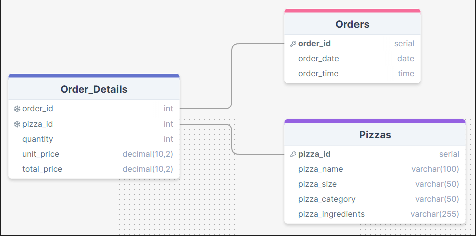
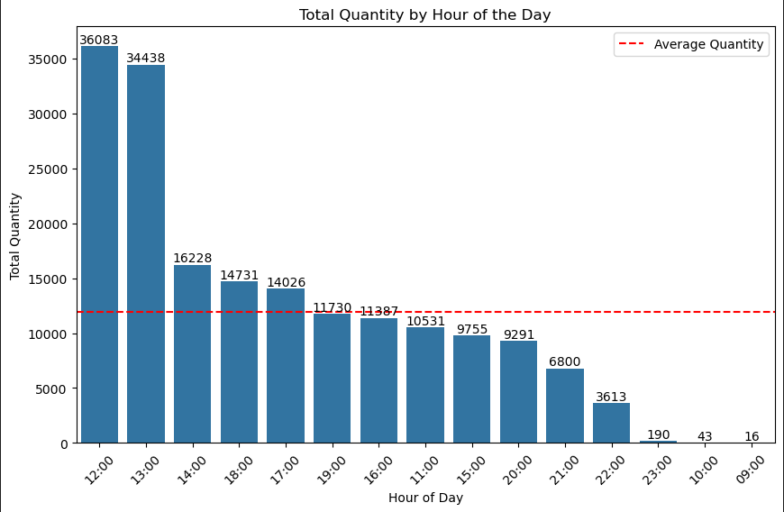
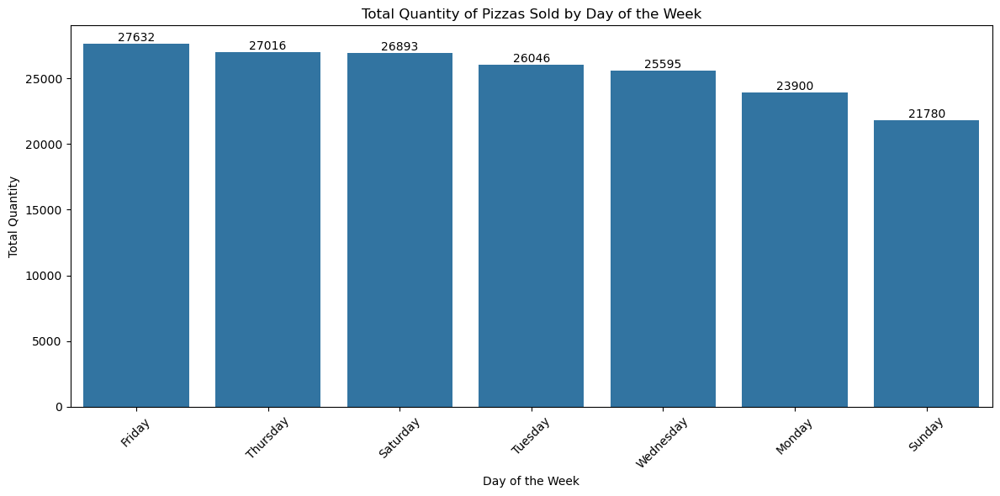
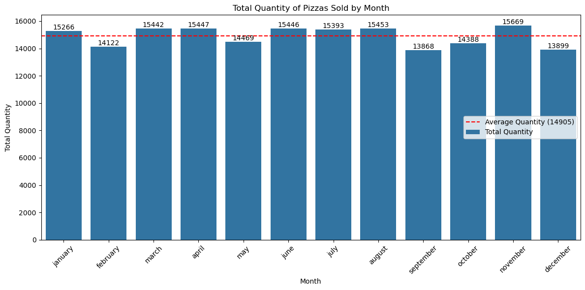
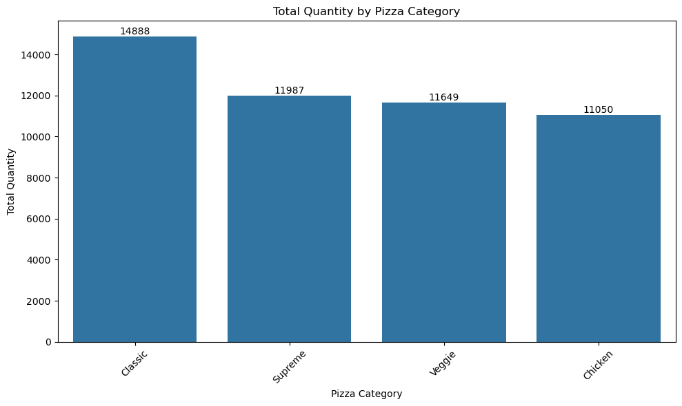
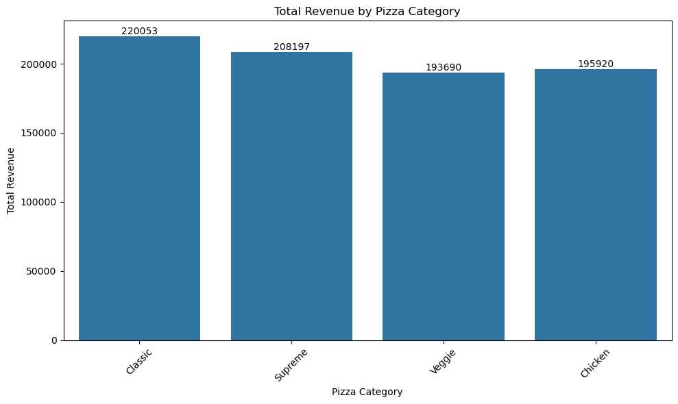
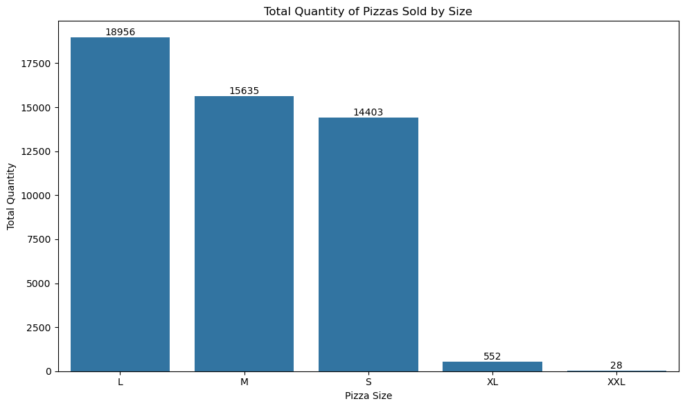
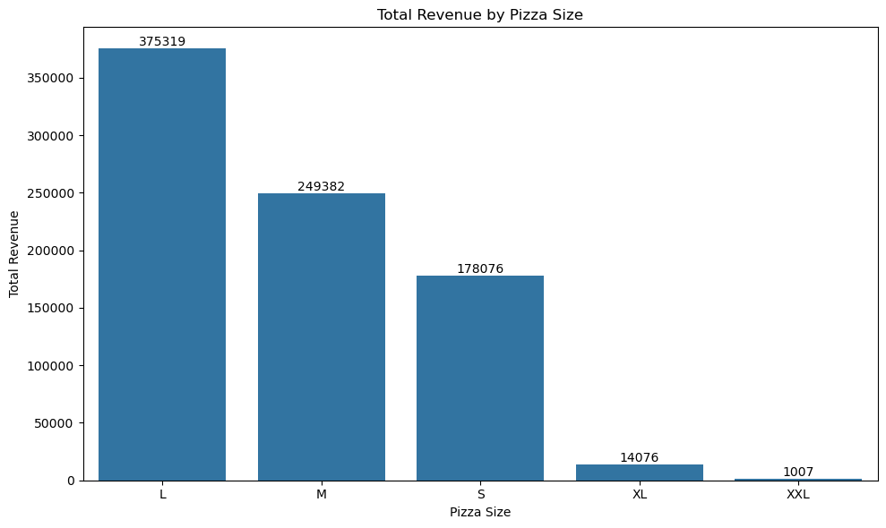

# Pizza-Sales-SQL-Project

## Project Overview
This project aims to analyze pizza sales data to uncover key insights and provide actionable recommendations for improving business performance. The project involves: 
- Data cleaning;
- Database design;
- Performing ad-hoc analysis using SQL queries to extract insights into pizza sales trends;
- Provide insights and recommendations.

## About the Dataset
This dataset contains detailed information about pizza orders, including specifics about the pizza variants, quantities, pricing, dates, times, and categorization details.

1. **pizza_id**: A unique identifier assigned to each distinct pizza variant available for ordering;
2. **order_id**: A unique identifier for each order made, which links to multiple pizzas;
3. **pizza_name_id**: An identifier linking to a specific name of the pizza;
4. **quantity**: The number of units of a specific pizza variant ordered within an order;
5. **order_date**: The date when the order was placed;
6. **order_time**: The time when the order was placed;
7. **unit_price**: The cost of a single unit of the specific pizza variant;
8. **total_price**: The aggregated cost of all units of a specific pizza variant in an order;
9. **pizza_size**: Represents the size of the pizza (e.g., small, medium, large);
10. **pizza_category**: Indicates the category of the pizza, such as vegetarian, non-vegetarian, etc;
11. **pizza_ingredients**: Provides a list or description of the ingredients used in the pizza;
12. **pizza_name**: Specifies the name of the specific pizza variant ordered.

The data source: [Kaggle - Pizza Sales Dataset](https://www.kaggle.com/datasets/nextmillionaire/pizza-sales-dataset)

## Database Design
The database schema was designed to efficiently organize the pizza sales data. The schema includes the following tables:

- **Orders**: Stores order details such as order ID, date, and time;
- **Pizzas**: Contains information about different pizza variants, including their names, sizes, categories, and ingredients;
- **Order_Details**: Links orders to pizzas, capturing quantities, prices, and other order-specific details.

### Database Schema

## Data Population
The database was populated using Python scripts and environment variables stored in a `.env` file to ensure security and flexibility.

## Insights

### Popular and Unpopular Pizzas

#### Top-selling Pizzas:
1. The Classic Deluxe Pizza (2,453 orders)
2. The Barbecue Chicken Pizza (2,432 orders)
3. The Hawaiian Pizza (2,422 orders)
4. The Pepperoni Pizza (2,418 orders)
5. The Thai Chicken Pizza (2,371 orders)

#### Least Popular Pizzas:
1. The Brie Carre Pizza (490 orders)
2. The Mediterranean Pizza (934 orders)
3. The Calabrese Pizza (937 orders)
4. The Spinach Supreme Pizza (950 orders)
5. The Soppressata Pizza (961 orders)

### Sales Trends Over Time

#### Hourly Sales

**Most Profitable Hours**: 
1. 12:00 ($596,045 total revenue, 36,083 orders)
2. 13:00 ($569,168 total revenue, 34,438 orders)

**Least Profitable Hours**: 
1. 09:00 ($332 total revenue, 16 orders)
2. 10:00 ($730 total revenue, 43 orders)
3. 23:00 ($3,121 total revenue, 190 orders)
4. 22:00 ($59,375 total revenue, 3,121 orders)

- 

#### Profitability by Day of the Week
- **Most Profitable Days**: Friday (27,632 orders) and Thursday (27,016 orders) are the most profitable days of the week.
- **Least Profitable Days**: Sunday (21,780 orders) and Monday (23,900 orders) generated the lowest revenue.

#### Profitability by Month
- **Least Profitable Months**: May, October, February, December, and September were below average in revenue, with revenues ranging from $229,575 to $239,081.
- Although no clear seasonal pattern was identified, more data is needed to draw definitive conclusions.

### Profitability by Pizza Category
- **Most Popular Category**: Classic pizzas are the most popular, generating $220,053 in revenue and selling 14,888 units.
- **Least Popular Category**: Chicken pizzas were the least popular, generating $195,920 in revenue from 11,050 units sold.

### Profitability by Pizza Size
- **Most Popular Sizes**: Large (L) and Medium (M) pizzas generated the highest revenue, with $375,319 and $249,382 respectively.
- **Least Popular Sizes**: Extra Large (XL) and Extra Extra Large (XXL) pizzas generated the lowest revenue, with minimal sales and revenues of $14,076 and $1,007 respectively.

## Recommendations

### Focus on Popular Pizzas:
- Increase marketing and promotion efforts for the top-selling pizzas, such as The Classic Deluxe Pizza and The Barbecue Chicken Pizza, to maintain high demand and boost revenue.

### Optimize Operations During Peak Hours:
- Ensure sufficient stock and staffing during peak hours from 12:00 PM to 1:00 PM to maximize revenue. Consider offering special promotions during these hours to further increase sales.

### Less Profitable Hours

#### Analysis of Low Sales Hours:
- The sales during the hours of 22:00, 09:00, 10:00, and 23:00 are significantly lower compared to peak hours. For instance, the revenue at 09:00 was just $332, at 10:00 it was $730, and at 23:00 it was $3,121 for the entire year.
- However, we lack data on staffing levels and employee wages, which would be necessary for a more in-depth analysis of operational efficiency during these low-sales periods.

#### Recommendation 1: Optimize Staffing:
- If the staffing levels during these low-sales hours are the same as during peak hours (12:00, 13:00), it might be worth considering adjusting the number of staff to better align with the reduced demand. This could help reduce operational costs while maintaining service quality.

#### Recommendation 2: Consider Reducing Operating Hours:
- Another option is to reduce operating hours by closing the store during 09:00, 10:00, and 23:00. The sales during these times are minimal and likely do not justify the cost of keeping the store open.
- For example, total sales at 09:00 brought in $332, at 10:00 $730, and at 23:00 $3,121 over the course of the year. It is likely that the labor costs during these times exceed the profits generated.
- Closing during these hours could also be presented positively to staff as an effort to improve work-life balance, allowing employees to start later or finish earlier.

#### Additional Observation:
- It's reasonable to infer that the low sales during these times are due to the time of day rather than a recent change in operating hours. The data shows consistent orders at 23:00 and 10:00 throughout the year, suggesting that the store has been open during these times for a significant period.
- The exception is 09:00, where only one large order was recorded in the eleventh month (16 pizzas in a single order). The average order size is typically around 2 pizzas (2.32, to be precise).
- 

### Encourage Sales on Less Profitable Days of the Week:
- Consider introducing special offers or promotions on Sundays and Mondays to stimulate sales on these less profitable days.

### Reevaluate Strategies by Month:
- Since certain months have shown below-average revenue, it may be beneficial to introduce seasonal promotions or new product offerings during these periods to boost sales.

### Focus on Popular Pizza Sizes:
- Continue to offer a wide range of Large (L) and Medium (M) pizzas as they generate the most revenue.
