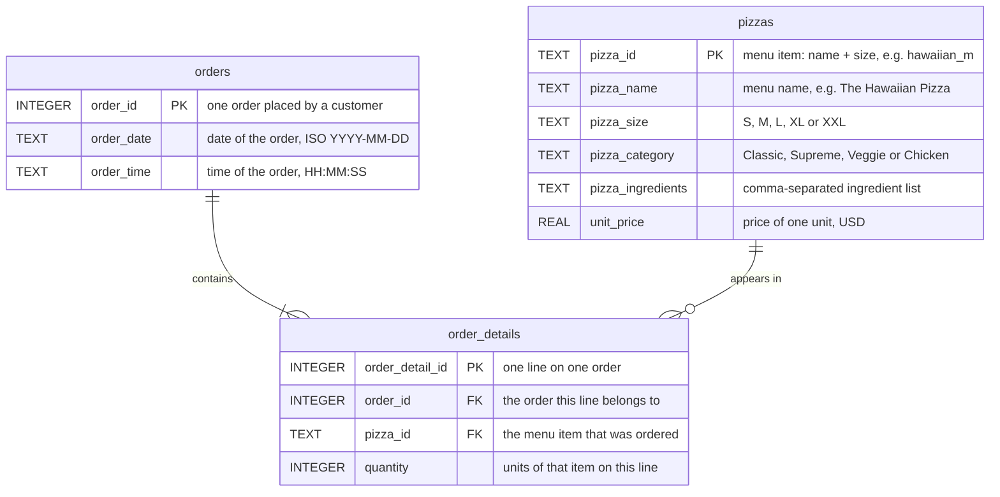
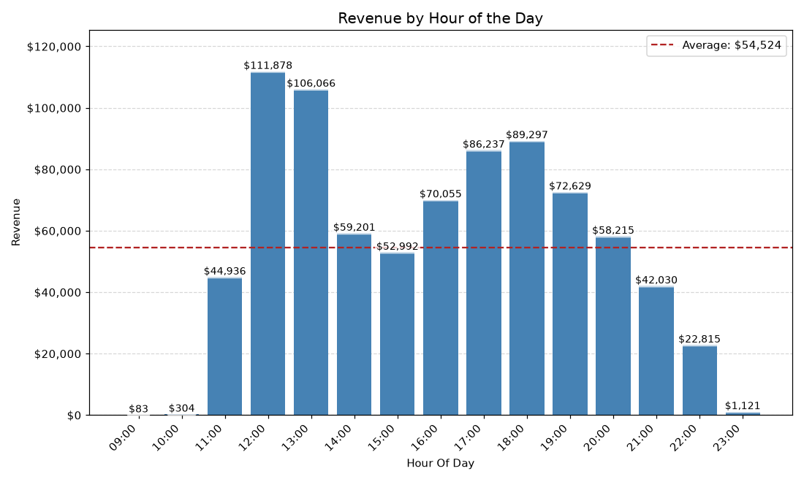
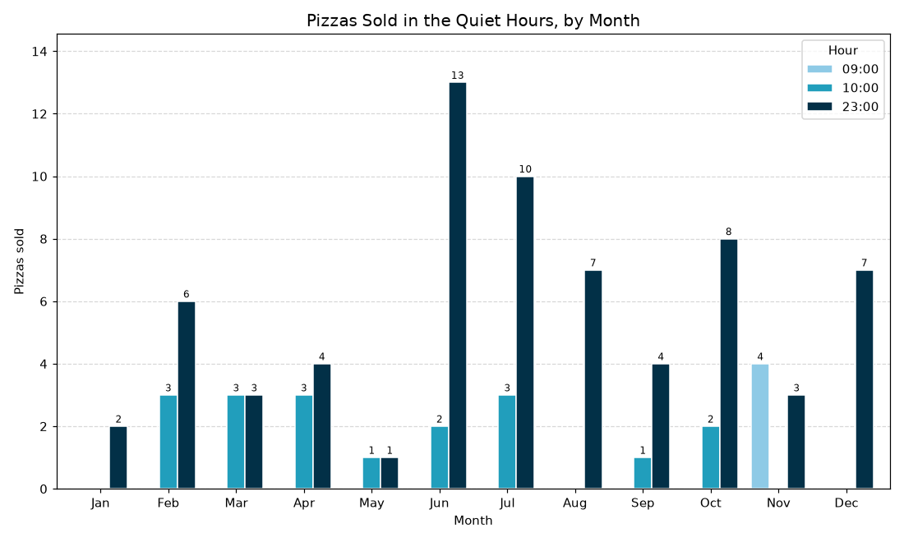
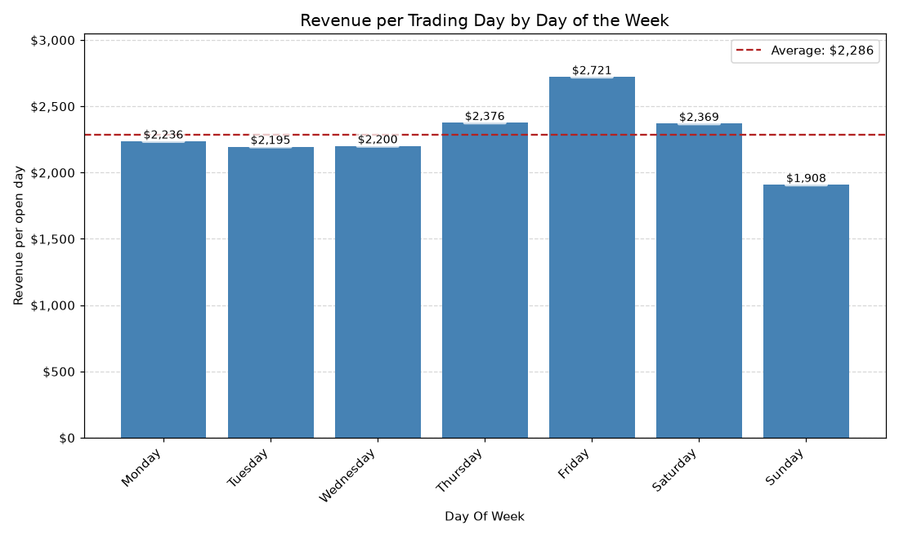
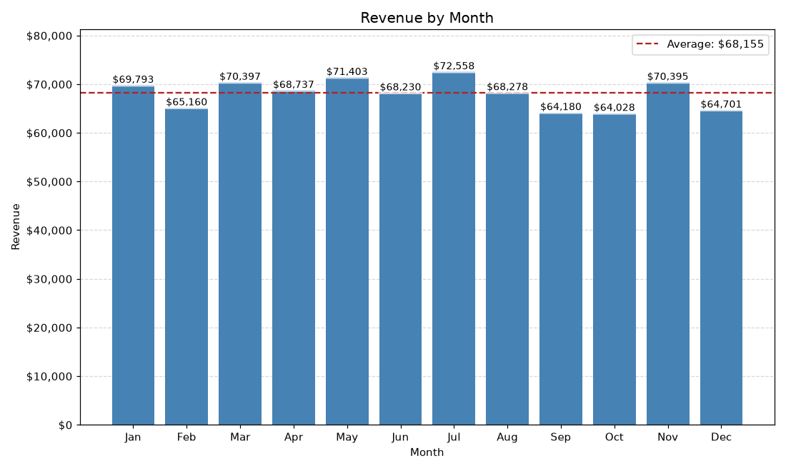
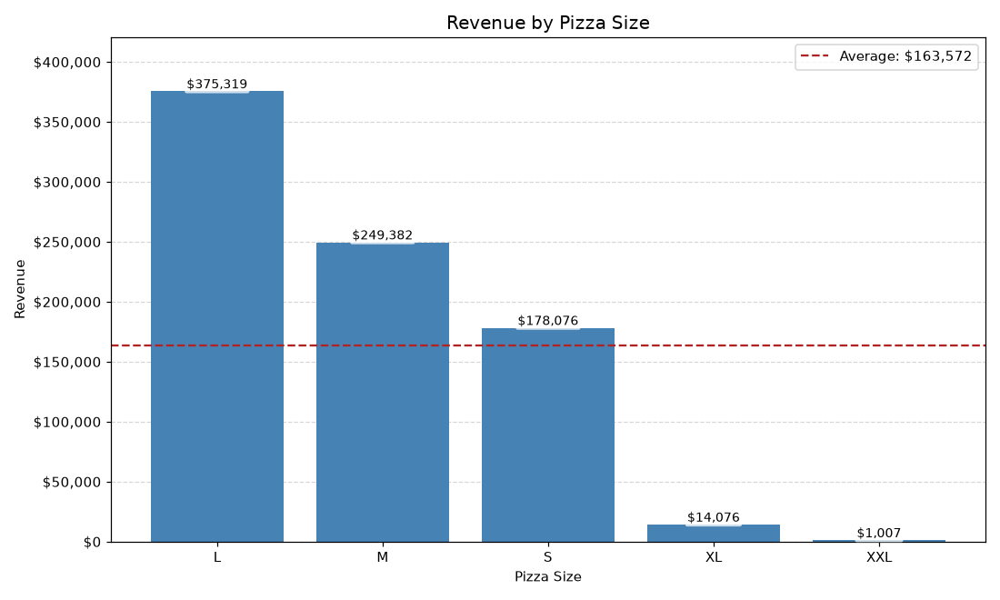

# Pizza Sales Analysis | SQL Project

A year of pizza sales (2015) analysed end to end: 21,350 orders, 49,574 pizzas, \$817,860 in
revenue. Raw CSV → cleaned → SQLite → SQL analysis → charts, reproducible from two notebooks.

> **Audited and verified.** This project was re-audited end to end in September 2026. The data
> model was rebuilt, the three dataset traps described in [Data Quality](#data-quality) were
> fixed, and every figure below was re-derived from the database and cross-checked against the
> source CSV. Charts are generated from queries, not typed in by hand. A summary of what changed
> is in [What the Audit Changed](#what-the-audit-changed).

## Table of Contents

1. [Key Findings](#key-findings)
2. [Project Overview](#project-overview)
3. [About the Dataset](#about-the-dataset)
4. [Database Design](#database-design)
5. [Data Quality](#data-quality)
6. [Insights](#insights)
7. [Recommendations](#recommendations)
8. [Limitations](#limitations)
9. [Running the Project](#running-the-project)
10. [What the Audit Changed](#what-the-audit-changed)

## Key Findings

- **Five hours a day carry the business.** Lunch (12:00–13:00) and dinner (17:00–19:00) together
  produce **57%** of annual revenue.
- **Three hours produce almost nothing.** 09:00, 10:00 and 23:00 earn **\$1,508 for the whole
  year** — 0.18% of revenue. At 09:00 the shop took exactly one order in twelve months.
- **Size matters more than recipe.** S, M and L are **98.2%** of revenue; XL and XXL together are
  1.8%. Meanwhile the four menu categories sit within 3.2 percentage points of each other.
- **Sunday is the weak day, Friday the strong one.** Sunday runs 15.1% below the weekly average,
  Friday 16.5% above.
- **There is no seasonality to plan around.** Every month of 2015 lands within ±6% of the
  monthly average.

Each of these turns into a concrete action in [Recommendations](#recommendations); the evidence
behind them is in [Insights](#insights).

## Project Overview

The goal is to find where the revenue comes from and where it is being left on the table. The
project covers:

- data cleaning and format validation;
- relational database design in SQLite;
- data population with enforced constraints and integrity checks;
- ad-hoc analysis in SQL (CTEs, window functions, a recursive calendar);
- charts generated from the database;
- insights and recommendations.

Every number in this README is the output of a query in [main.ipynb](main.ipynb), and every chart
is generated by [visualisations.ipynb](visualisations.ipynb) from the same database.

## About the Dataset

48,620 order line items covering the whole of 2015.

| Column | Meaning |
|---|---|
| `pizza_id` | **Line-item** identifier, one per CSV row, *not* a pizza variant |
| `order_id` | Order identifier; one order contains several line items |
| `pizza_name_id` | **Pizza variant** identifier (name + size), e.g. `hawaiian_m` |
| `quantity` | Units of that variant in that order |
| `order_date` | Date the order was placed |
| `order_time` | Time the order was placed |
| `unit_price` | Price of one unit of the variant |
| `total_price` | `quantity * unit_price` for the line item |
| `pizza_size` | S, M, L, XL, XXL |
| `pizza_category` | Classic, Supreme, Veggie, Chicken |
| `pizza_ingredients` | Ingredient list |
| `pizza_name` | Menu name of the pizza |

Source: [Kaggle — Pizza Sales Dataset](https://www.kaggle.com/datasets/nextmillionaire/pizza-sales-dataset)

Two column names are misleading. `pizza_id` is unique per row (48,620 values) and identifies a
line item, not a product. The actual menu item is `pizza_name_id` (91 values). The schema is built
on the latter.

## Database Design

Three tables, one grain each: 21,350 orders, 91 menu items, 48,620 line items.


```mermaid
erDiagram
    orders ||--|{ order_details : "contains"
    pizzas ||--o{ order_details : "appears in"

    orders {
        INTEGER order_id PK "one order placed by a customer"
        TEXT    order_date "date of the order, ISO YYYY-MM-DD"
        TEXT    order_time "time of the order, HH:MM:SS"
    }
    pizzas {
        TEXT    pizza_id PK "menu item: name + size, e.g. hawaiian_m"
        TEXT    pizza_name "menu name, e.g. The Hawaiian Pizza"
        TEXT    pizza_size "S, M, L, XL or XXL"
        TEXT    pizza_category "Classic, Supreme, Veggie or Chicken"
        TEXT    pizza_ingredients "comma-separated ingredient list"
        REAL    unit_price "price of one unit, USD"
    }
    order_details {
        INTEGER order_detail_id PK "one line on one order"
        INTEGER order_id FK "the order this line belongs to"
        TEXT    pizza_id FK "the menu item that was ordered"
        INTEGER quantity "units of that item on this line"
    }
```

### Reading the diagram

Each relationship is read left to right, from the "one" side to the "many" side. The two verbs
differ because the two relationships mean different things:

- **`orders ||--|{ order_details` — one order *contains* one or more lines.** The lines belong to
  the order and have no meaning without it; remove the order and they are orphans. That is
  ownership, so the verb is *contains*.
- **`pizzas ||--o{ order_details` — one menu item *appears in* zero or more lines.** A pizza is
  not owned by any order. It sits on the menu whether or not anyone buys it, and a line merely
  points at it. That is a lookup, so the verb is *appears in*.

The symbols at each end give the counts: `||` is exactly one, `|{` is one or more, `o{` is zero or
more. So a line always belongs to exactly one order and names exactly one menu item; an order
always has at least one line; a menu item may have none.

That last `o` describes what the schema *permits*, not what this data contains — in 2015 all 91
menu items were ordered at least once, and orders carry between 1 and 21 lines. A pizza added to
the menu today would simply have zero lines until someone orders it.

### Design notes

- **`pizzas` is keyed on the variant** (`hawaiian_m`), not on the CSV's `pizza_id`. A dimension
  table needs a key that repeats across rows; `pizza_id` never does.
- **`unit_price` lives in `pizzas`**, since every variant has exactly one price across the whole
  year. Revenue is derived as `order_details.quantity * pizzas.unit_price`.
- **`total_price` is not stored.** It equals `quantity * unit_price` for all 48,620 rows
  (asserted during the load), so storing it would only create a way for the two to disagree.
- **`UNIQUE (order_id, pizza_id)`** prevents the same variant being recorded twice in one order.
- **`pizzas.pizza_id` is `TEXT NOT NULL PRIMARY KEY`.** SQLite keeps a legacy quirk where a
  non-`INTEGER` primary key column still accepts `NULL`, so the `NOT NULL` here is not redundant.
- **All three tables are `STRICT`**, so SQLite rejects a value of the wrong type instead of
  quietly coercing it: the text `'three'` cannot end up in `quantity`.

## Data Quality

Three things in this dataset are easy to get wrong. Each one changes the results silently: the
query still succeeds, and the output still looks plausible.

### 1. `orders` must be deduplicated before it is joined

The CSV has one row per line item, so an `orders` table built straight from it carries 48,620 rows
with only 21,350 distinct `order_id` values. Joining `order_details` to that table multiplies
every line item by the number of items in its order and **inflates every time-based aggregate by
roughly 3.6×** — while leaving category and size figures untouched, since those join on a key that
is genuinely unique per row.

Making `orders.order_id` a primary key rules the mistake out. The load also asserts that the
three-table join returns exactly 48,620 rows.

### 2. The slash dates are `d/m/Y`, not `m/d/Y`

`order_date` mixes `dd-mm-yyyy` (day > 12) with a slash format where both parts are ≤ 12 — the
signature of a spreadsheet that converted the unambiguous dates and left the rest as text. Both
readings parse without error, so the format has to be settled on evidence rather than on a
library default.

`order_id` is issued sequentially in time, so the correct reading is the one that keeps dates
non-decreasing when rows are sorted by `order_id`:

| Interpretation | Chronology violations |
|---|---:|
| `m/d/Y` | 22 |
| `d/m/Y` | **0** |

Reading them as `m/d/Y` misdates 19,587 rows — 40% of the data — and shuffles them between months
and weekdays.

### 3. The calendar has holes

Seven days in 2015 have no orders at all, and they are not spread evenly:

| Missing day | Weekday |
|---|---|
| 2015-09-24 | Thursday |
| 2015-09-25 | Friday |
| 2015-10-05 | Monday |
| 2015-10-12 | Monday |
| 2015-10-19 | Monday |
| 2015-10-26 | Monday |
| 2015-12-25 | Friday |

**Every Monday in October is missing.** Monday therefore has 48 trading days against 52 for most
other weekdays, so comparing weekday *totals* penalises it for four shifts that were never
recorded. The analysis reports revenue per trading day alongside the totals for that reason.

### Checks run on every load

```
[PASS] orders.order_id is unique
[PASS] pizzas holds 91 variants
[PASS] no orphan foreign keys
[PASS] no order without line items
[PASS] join does not fan out
[PASS] revenue matches the CSV
```

## Insights

**2015 totals:** 21,350 orders · 49,574 pizzas · \$817,860 revenue · 358 trading days ·
\$2,285 average day. A typical order is 2.32 pizzas worth \$38.31.

### Popular and Unpopular Pizzas

| Rank | Best seller | Units | Worst seller | Units |
|---:|---|---:|---|---:|
| 1 | The Classic Deluxe | 2,453 | The Brie Carre | 490 |
| 2 | The Barbecue Chicken | 2,432 | The Mediterranean | 934 |
| 3 | The Hawaiian | 2,422 | The Calabrese | 937 |
| 4 | The Pepperoni | 2,418 | The Spinach Supreme | 950 |
| 5 | The Thai Chicken | 2,371 | The Soppressata | 961 |

The Brie Carre is the outlier: it sells about half as much as the next-worst pizza. A narrow
listing is not the explanation — it is one of three items sold in a single size, and the other two
(The Big Meat, S only; The Five Cheese, L only) move 1,914 and 1,409 units. Price is the more
likely cause: the cheapest size it can be bought in costs \$23.65, against a menu-wide average
entry price of \$12.79 and a next-highest of \$18.50.

### Sales by Hour



Trade is concentrated in two peaks:

- **Lunch, 12:00–13:00** — \$217,944, **26.6%** of annual revenue from two hours a day.
- **Dinner, 17:00–19:00** — \$248,163, **30.3%**.
- **09:00, 10:00 and 23:00 combined** — \$1,508 for the entire year, **0.18%** of revenue and
  roughly 108× below the average hour.

09:00 is not so much a slow hour as a rounding error. Across the whole year it contains **exactly
one order**: #19176, placed at 09:52 on 2015-11-24, four pizzas for \$83.



23:00 is the only quiet hour with a steady trickle. 09:00 is that single November order, and
10:00 appears in eight months out of twelve, one order at a time.

### Sales by Day of the Week

| Day | Revenue, $ | Trading days | Revenue per open day, $ |
|---|---:|---:|---:|
| Friday | 136,074 | 50 | 2,721 |
| Thursday | 123,529 | 52 | 2,376 |
| Saturday | 123,182 | 52 | 2,369 |
| Monday | 107,330 | 48 | 2,236 |
| Wednesday | 114,408 | 52 | 2,200 |
| Tuesday | 114,134 | 52 | 2,195 |
| Sunday | 99,204 | 52 | 1,908 |



Friday is the clear best day, **16.5%** above the weekly average.

Monday ranks second-worst on total revenue, but it traded on four fewer days than the rest of the
week (see [Data Quality](#data-quality)); measured per trading day it sits mid-table, in fourth.
**Sunday is the only genuinely weak day** — 15.1% below average on totals, and last on revenue per
trading day as well.

### Sales by Month



Revenue is flat: every month lands between **\$64,028** and **\$72,558** against an average of
**\$68,155**, a spread of about ±6%. July and May are the strongest; October, September and
December the weakest.

October and September are partly explained by the seven missing days rather than by demand.
December's dip is genuine, and 25 December is the one day in the dataset that looks like a
deliberate closure.

**There is no usable seasonal signal here** — a ±6% band across a single year is not something to
plan against.

### Category and Size

| Category | Units | Revenue, $ | Share |
|---|---:|---:|---:|
| Classic | 14,888 | 220,053 | 26.9% |
| Supreme | 11,987 | 208,197 | 25.5% |
| Chicken | 11,050 | 195,920 | 24.0% |
| Veggie | 11,649 | 193,690 | 23.7% |

The four categories are effectively tied. Classic leads on units by a wider margin than on
revenue because it is the cheapest category per pizza.

| Size | Units | Revenue, $ | Share |
|---|---:|---:|---:|
| L | 18,956 | 375,319 | 45.9% |
| M | 15,635 | 249,382 | 30.5% |
| S | 14,403 | 178,077 | 21.8% |
| XL | 552 | 14,076 | 1.7% |
| XXL | 28 | 1,007 | 0.1% |



Size is where the real concentration is: **L alone is 46% of revenue**, and L, M and S together
are **98.2%**. XL is offered on one pizza only (The Greek), XXL likewise, and XXL sold **28 units
in a year** — about one every two weeks.

## Recommendations

### 1. Size operations around the lunch and dinner peaks

12:00–13:00 and 17:00–19:00 are 57% of revenue in five hours a day. Staffing, prep and delivery
capacity should be planned around those windows first; everything else is a secondary constraint.
Combo and pre-order offers work best aimed just *before* each peak (11:00 and 16:00), to flatten
the load rather than add to it.

### 2. Trim the opening hours at both ends

09:00, 10:00 and 23:00 generate \$1,508 a year between them — 0.18% of revenue, below the cost of
having anyone in the building. Opening at 11:00 and closing at 22:00 would give up that 0.18% and
remove roughly three staffed hours a day.

The caveat: this dataset has no cost, staffing or wage data, so the argument rests on revenue
alone. It is strong enough to justify a trial — close those hours for a quarter and check whether
the demand shifts to 11:00 or simply disappears.

### 3. Target Sunday, the weakest trading day

Sunday runs 15.1% below the weekly average on totals and is last on revenue per trading day as
well. It is the clearest candidate for a family or bundle offer.

Monday is a different case and should not be treated the same way. It looks weak on totals only
because four of its shifts are missing from the data; per trading day it is mid-table. Confirm
whether those four October Mondays were genuine closures or a recording gap before deciding
whether Monday needs anything at all.

### 4. Drop XXL, and review XL

XXL sold 28 units all year (\$1,007) and exists on a single pizza. It costs menu space, prep
training and inventory for 0.1% of revenue. XL is only marginally better at 1.7%.

The alternative reading is that both sizes are offered on one pizza only and so never had a fair
test. If the intent is to keep large formats, extend XL to the top five sellers and measure again;
if not, remove both and simplify the menu.

### 5. Re-price The Brie Carre, or drop it

At 490 units it is the slowest item on the menu, and the obvious excuse does not hold: it is not
handicapped by being sold in one size, because The Big Meat is also S-only and moves 1,914 units.
What is unusual is the price. Its only size is a small at \$23.65, while the average entry price
on this menu is \$12.79 and the next dearest is \$18.50. It costs more than every large on the
menu (the dearest L is \$21.00) and is sold as a small.

It also carries five ingredients that appear on no other pizza (brie carre cheese, prosciutto,
caramelised onions, pears, thyme), so it holds dedicated inventory for the slowest-moving dish.
Either test it at a price closer to its peers, or remove it and free that inventory.

### 6. Do not build a seasonal calendar yet

Monthly revenue varies by ±6% with no discernible pattern, and part of that spread is missing days
rather than demand. A seasonal campaign calendar needs at least two more years of data.

## Limitations

- **No customer identifiers** — no repeat rate, basket affinity or cohort analysis is possible.
- **No costs or margins** — "most profitable" throughout this analysis means *highest revenue*,
  not highest profit. The staffing and menu recommendations are directional until cost data is
  available.
- **No staffing, delivery times or promotion history** — the low-revenue hours can be measured,
  but their true operating cost cannot.
- **A single year, with seven days missing** — enough to describe 2015, not enough to establish
  seasonality.

## Running the Project

```
data/pizza_sales.csv     raw dataset (48,620 line items)
main.ipynb               cleaning, schema, loading, integrity checks, SQL analysis
visualisations.ipynb     charts, built from the database
image/                   generated charts
pizza_sales.db           SQLite database (not tracked; built by main.ipynb)
requirements.txt         pandas, matplotlib, jupyter
```

```bash
python -m venv .venv && .venv/Scripts/activate && pip install -r requirements.txt
```

Then run `main.ipynb` top to bottom — it builds `pizza_sales.db` from the CSV — followed by
`visualisations.ipynb`, which reads that database and writes `image/`.

The only dependencies are pandas, matplotlib and Jupyter. SQLite ships with Python, so there is no
server to install and no credentials to configure.

**Re-running is safe.** `main.ipynb` is idempotent: the schema cell drops and recreates the three
tables, and the load cell clears them before inserting. Running the notebook again over an
existing `pizza_sales.db` — or running the load cell on its own, any number of times — rebuilds
the same 21,350 / 91 / 48,620 rows rather than appending to them. Deleting `pizza_sales.db`
between runs is never necessary; a database left over from an older version of the schema is
replaced automatically.

## What the Audit Changed

<details>
<summary>September 2026 — full re-audit of an earlier version of this project</summary>

An earlier version of this analysis ran on PostgreSQL and reported inflated figures for every
time-based metric. The audit rebuilt the pipeline and re-derived every number.

**Data model**

- `orders` is now deduplicated to one row per order and keyed on `order_id`. Previously it held
  one row per *line item*, and the join to `order_details` inflated all hourly, weekday and
  monthly figures by roughly 3.6×. Category and size figures were unaffected and did not change.
- `pizzas` is now keyed on `pizza_name_id` (91 menu items). Previously it was keyed on the CSV's
  `pizza_id`, producing a 48,620-row "dimension" table that was a copy of the fact table.
- Slash-format dates are now parsed as `d/m/Y`. Reading them as `m/d/Y` had misdated 19,587 rows
  and moved them between months and weekdays.
- The schema is now enforced: primary keys, foreign keys, `CHECK` and `UNIQUE` constraints,
  `STRICT` type checking, an explicit `NOT NULL` on the text primary key, plus six integrity
  checks that run on every load.

**Conclusions that changed**

- Monday is no longer treated as an underperforming day. Its totals were depressed by four
  missing October trading days; per trading day it is mid-table. Sunday is the genuinely weak day.
- May was previously reported as a below-average month. With dates parsed correctly it is above
  average.
- The Brie Carre's low volume is now attributed to its price rather than to its single-size
  listing, since the two other single-size pizzas sell three to four times as much.

**Reproducibility**

- Migrated from PostgreSQL to SQLite: no server, no `.env`, no credentials.
- Chart data is read from the database. It had previously been hard-coded into the plotting
  notebook, which is why the inflated figures went unnoticed.
- Added `requirements.txt`, replaced the repeated per-chart plotting blocks with a single
  function, and added a revenue-per-trading-day chart.

</details>
