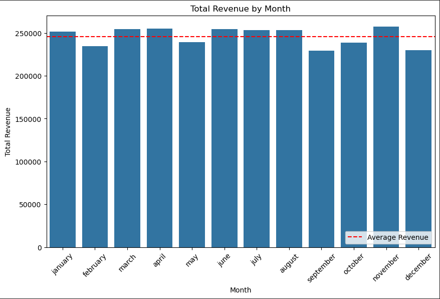

# Pizza-Sales-SQL-Project

## Project Overview
This project aims to analyze pizza sales data to uncover key insights and provide actionable recommendations for improving business performance. The project involves: 
- data cleaning,
- database design,
- performing Ad-hoc Analysis using various SQL queries to extract insights on pizza sales trends .

## About the Dataset
This dataset contain detailed information about pizza orders, including specifics about the pizza variants, quantities, pricing, dates, times, and categorization details.

1. **pizza_id**: A unique identifier assigned to each distinct pizza variant available for ordering.
2. **order_id**: A unique identifier for each order made, which links to multiple pizzas.
3. **pizza_name_id**: An identifier linking to a specific name of the pizza.
4. **quantity**: The number of units of a specific pizza variant ordered within an order.
5. **order_date**: The date when the order was placed.
6. **order_time**: The time when the order was placed.
7. **unit_price**: The cost of a single unit of the specific pizza variant.
8. **total_price**: The aggregated cost of all units of a specific pizza variant in an order.
9. **pizza_size**: Represents the size of the pizza (e.g., small, medium, large).
10. **pizza_category**: Indicates the category of the pizza, such as vegetarian, non-vegetarian, etc.
11. **pizza_ingredients**: Provides a list or description of the ingredients used in the pizza.
12. **pizza_name**: Specifies the name of the specific pizza variant ordered.

The data source: [link](https://www.kaggle.com/datasets/nextmillionaire/pizza-sales-dataset)

## Database Design
The database schema was designed to organize the pizza sales data efficiently. The schema includes the following tables:

- **Orders**: Stores order details such as order ID, date, and time.
- **Pizzas**: Contains information about different pizza variants, including their names, sizes, categories, and ingredients.
- **Order_Details**: Links orders to pizzas, capturing quantities, prices, and other order-specific details.

### Database Schema

## Data Population
The database was populated using Python scripts and environment variables stored in a `.env` file to ensure security and flexibility.

## Insights

### Popular and unpopular pizzas:

#### Top-selling Pizzas:
1. The Classic Deluxe Pizza (2453 orders)
2. The Barbecue Chicken Pizza (2432 orders)
3. The Hawaiian Pizza (2422 orders)
4. The Pepperoni Pizza (2418 orders)
5. The Thai Chicken Pizza (2371 orders)

#### Least Popular Pizzas:
1. The Brie Carre Pizza (490 orders)
2. The Mediterranean Pizza (934 orders)
3. The Calabrese Pizza (937 orders)
4. The Spinach Supreme Pizza (950 orders)
5. The Soppressata Pizza (961 orders)

### Sales Trends Over Time:

#### Hourly sales:

##### Most Profitable Hours: 
The hours from 12:00 to 13:00 are the most profitable, with total revenue of $596,045 and $569,168 respectively, which is more than twice above the average revenue ($196,746).

##### Least Profitable Hours: 
1. 09:00 ($332 total revenue, 16 orders),
2. 10:00 ($730 total revenue, 43 orders),
3. 23:00 ($3121 total revenue, 190 orders),
4. 22:00 ($59,375 total revenue, 3121 orders)

- 

#### Profitability by Day of the Week:

- Most Profitable Days: Friday (27,632 orders) and Thursday (27,016 orders) are the most profitable days of the week.
- Least Profitable Days: Sunday (21,780 orders) and Monday (23,900 orders) showed the lowest revenue.

#### Profitability by Month:

Least Profitable Months: May, October, February, December, and September were below average in revenue, with revenues ranging from $229,575 to $239,081. Although no clear seasonality pattern was identified, more data is needed to draw definitive conclusions.

### Revenue by Pizza Category:
